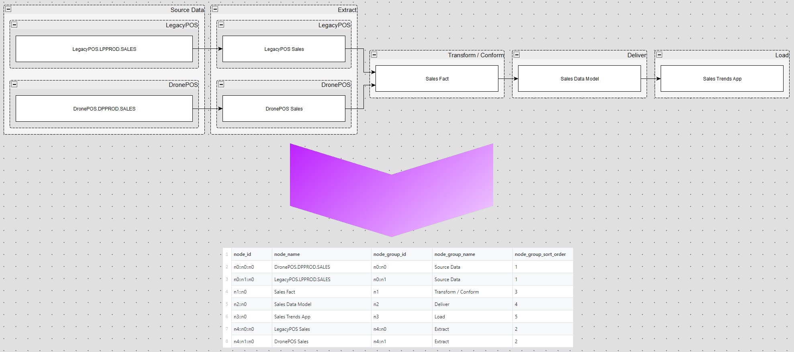

# graphml-interpreter

## Overview
This Python script can use a [GraphML file](https://en.wikipedia.org/wiki/GraphML "GraphML - Wikipedia"), such as one produced by [yEd](https://www.yworks.com/products/yed "yEd Homepage - yworks"), as a data source. It extracts label information from a hierarchical flow chart to produce a flat file that can be used in other programs.

## Graphml to CSV Conversion Example

